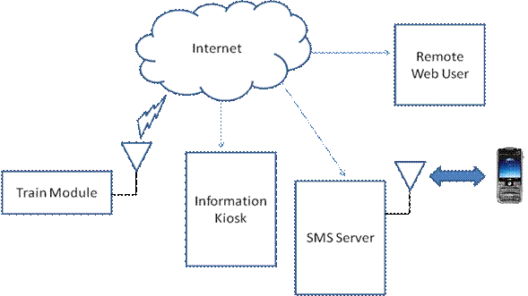
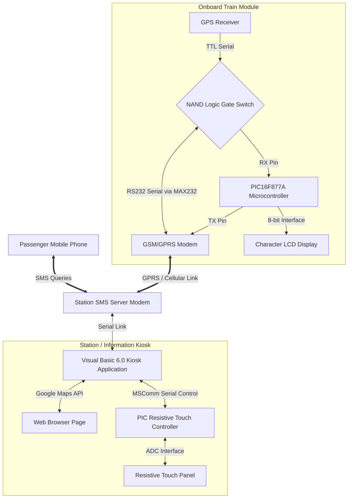
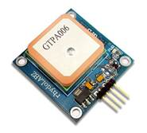
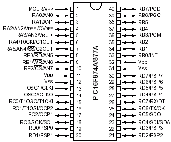
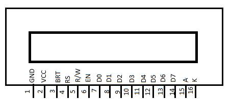
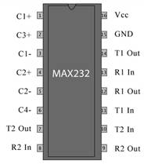
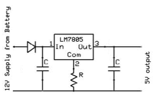
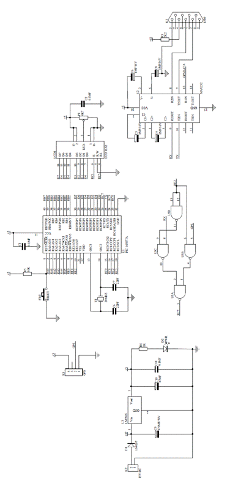
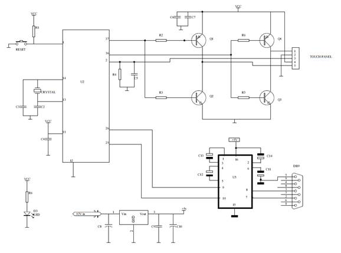

# 🚄 Train Tracking and Information System with Touch-Screen & SMS Interface

> **📦 College B.Tech Main Project (May 2012)**  
> An automated telemetry tracking system that gathers real-time train locations using onboard GPS, transmits coordinates over GPRS, and presents the live position on an interactive touch-screen kiosk (Google Maps) and responds to passenger queries via automated SMS messages.

---

## 📋 Table of Contents
1. [Project Overview & Abstract](#-project-overview--abstract)
2. [Key Features](#-key-features)
3. [System Architecture & Components](#-system-architecture--components)
4. [Hardware & Power Components](#-hardware--power-components)
5. [PCB Fabrication](#-pcb-fabrication)
6. [Software & Development Tools](#-software--development-tools)
7. [Firmware & Source Code](#-firmware--source-code)
8. [Circuit Schematics](#-circuit-schematics)
9. [Getting Started & Build Instructions](#-getting-started--build-instructions)
10. [Results & Limitations](#-results--limitations)
11. [Future Scope](#-future-scope)
12. [Project Team & Credits](#-project-team--credits)
13. [License](#-license)

---

## 🌐 Project Overview & Abstract

This project was developed during our **Bachelor of Technology in Electronics & Communication Engineering** at the **Federal Institute of Science and Technology (FISAT)**, Ernakulam (affiliated with Mahatma Gandhi University).

Finding the real-time location of a train for a passenger on the move can be a difficult task, especially during inclement weather or night journeys. This system eliminates these difficulties by providing real-time tracking information directly to passenger mobile phones and station kiosks.

The tracking is implemented using a **GPS (Global Positioning System)** receiver onboard the train, controlled by a dedicated PIC microcontroller. The location data is uploaded to a remote station server via **GPRS/GSM** cellular network communication, allowing passengers to monitor train status by simply logging onto a webpage.

Passengers can query details in two ways:
1. **Web Interface**: Review whether a train is running on time and track its current coordinates on a live map.
2. **SMS Interface**: Query train locations via SMS commands and receive replies containing the current station, distance to the next station, and expected time of arrival (ETA).

---

## ✨ Key Features

*   **Real-time Location Telemetry**: The onboard train module continuously reads and parses GPS NMEA sentences (`$GPRMC`) to extract latitude, longitude, and speed.
*   **Dual-Peripheral Serial Sharing**: Built a custom logic-gate NAND switching circuit to multiplex the single PIC16F877A hardware USART RX line between the GPS module (TTL logic) and GPRS/GSM modem (CMOS RS232 logic via MAX232).
*   **Interactive Touch Kiosk**: Designed a station information kiosk running a Visual Basic 6.0 interface using a resistive touch-screen controller. Passengers can touch menu items to query trains and view locations plotted on Google Maps.
*   **Automated SMS Responder**: Passengers can send an SMS query containing the train number to the server. The server computes the distance to the next station (using the **Haversine formula**) and replies with the current station name, distance, and Expected Time of Arrival (ETA) based on train speed.
*   **Local LCD Debugging**: Displays local IP address, connection flags, and telemetry transfer status directly on an onboard character LCD.

---

## 🏗️ System Architecture & Components

The tracking system consists of three primary divisions:

### 1. Train Module
The onboard Train Module is responsible for location telemetry collection. The PIC microcontroller parses the latitude, longitude, and speed from the NMEA strings, controls the switching circuit to toggle between GPRS and GPS interfaces, and sends the coordinate packet over the GPRS cellular link.

### 2. Interactive Touch Kiosk
At stations, a resistive touch-screen panel is overlaid on a monitor to provide an interactive information kiosk. It uses a PIC coordinate reader to translate analog voltage drops into serial mouse movement commands, interfacing with a VB6 application that plots trains on Google Maps.

### 3. SMS Server
An automated desktop application connected to a GSM modem listens for inbound query messages. It decodes the query, calculates the distance to the next station and the Estimated Time of Arrival (ETA), and responds to the passenger's mobile phone.

---

## 🛠️ Hardware & Power Components

### Main Microcontrollers & Modules

| GPS Module (AN-Top) | GSM/GPRS Modem | PIC16F877A Controller |
| :---: | :---: | :---: |
|  |  |  |

### LCD & Level Conversion Components

| 16x2 LCD Display | MAX232 Level Converter | Power Supply Regulator |
| :---: | :---: | :---: |
|  |  |  |

*   **Microcontroller**: PIC16F877A (8-bit RISC, 8KB Flash, 368B RAM, 10-bit ADC).
*   **GPS Receiver**: Standalone 5V serial Patch Antenna On Top (POT) module.
*   **GSM/GPRS Modem**: RhydoLABZ Tri-Band Engine (EGSM 900MHz, DCS 1800MHz, PCS 1900MHz) with internal TCP/IP stack.
*   **Level Converter**: MAX232 for RS232-to-TTL level translation.
*   **Touch Panel**: 4-wire resistive touch screen with H-bridge driver.
*   **Display**: 16x2 characters intelligent LCD display with backlighting.
*   **Power Supply**: A 15V DC supply regulated down to a constant 5V using an LM7805 voltage regulator with built-in thermal and short-circuit protection.

---

## 🖨️ PCB Fabrication

The project involved custom hardware manufacturing:
*   **Layout Design**: Component layout was drafted on graph paper to minimize board footprint, followed by track routing mapped to handle varied current loads.
*   **Etching**: The layouts were printed onto positive copper black UV translucent artwork film, transferred to pre-coated photo-resist fiberglass (FR4) boards via UV exposure, and etched using a ferric chloride solution.
*   **Drilling & Soldering**: Custom drilling was done per component specifications (e.g., 1mm for ICs, 1.5mm for diodes) before final wave soldering and testing.

---

## 🖥️ Software & Development Tools

The development stack spanned multiple environments:
*   **Embedded C**: The core logic language for all onboard and touch-panel microcontrollers.
*   **Keil µVision IDE**: Used for project management, compiling, and debugging the embedded C code for the PIC microcontrollers.
*   **Visual Basic 6.0**: Utilized to build the interactive desktop GUI for the kiosk application, handling MSComm serial control libraries and rendering the Google Maps API.
*   **Protel**: Used for drawing the electronic circuit schematics and designing the PCB traces.

---

## 💻 Firmware & Source Code

The firmware source code has been extracted and organized into logical C files:

### 1. Onboard Train Module Firmware
Located under [`code/train_module/`](code/train_module/):
*   [`main.c`](code/train_module/main.c): Core firmware loop. Coordinates GPS parsing interrupts, handles GPRS modem TCP commands (`AT+CIPSERVER`, `AT+CIPSEND`), and manages the multiplexer switching pin (`RE2`).
*   [`modem.h`](code/train_module/modem.h) & [`modem.c`](code/train_module/modem.c): Hardware configurations, LCD pin mapping, string and command functions, and UART drivers.
*   [`delay.h`](code/train_module/delay.h) & [`delay.c`](code/train_module/delay.c): Microsecond and millisecond delay loops tailored for a 20MHz crystal oscillator.

### 2. Touch Screen Kiosk Firmware
Located under [`code/touch_module/`](code/touch_module/):
*   [`main.c`](code/touch_module/main.c): Scans X and Y axes on the resistive touch panel by manipulating transistors on the H-bridge (`RB3`, `RB4`, and `RA0` ADC input) and transmits Microsoft serial mouse protocol coordinate packets.

---

## 🔌 Circuit Schematics

The original schematic and PCB designs are stored in PDF format under the [`diagram/`](diagram/) folder:

### 1. Onboard Train Module
Contains the PIC16F877A, character LCD, MAX232 level converter, and the NAND gate multiplexer switching logic.
*   [Protel Schem.pdf](diagram/Protel%20Schem.pdf) (Complete PCB Schematic)

### 2. Touch Screen Controller
Features the H-bridge switching transistors and analog-to-digital coordinate reader.
*   [touch.pdf](diagram/touch.pdf) (Complete PCB Schematic)

---

## 🚀 Getting Started & Build Instructions

### 1. Compiling Microcontroller Firmware
The microcontrollers are programmed in Embedded C using the HI-TECH C compiler (or Keil µVision IDE):
1.  Open Keil µVision and create a new project.
2.  Select **PIC16F877A** as the target device.
3.  Add the C source files from `code/train_module/` or `code/touch_module/`.
4.  Configure the oscillator frequency to **20 MHz** (HS oscillator mode).
5.  Build the project to generate the target `.hex` flash binary.
6.  Flash the binary using a PIC programmer (e.g., PICkit 2 or PICkit 3).

### 2. Desktop Kiosk Application
The desktop client and SMS responder are built using Visual Basic 6.0:
1.  Install the Visual Basic 6.0 development environment on a Windows host.
2.  Install the MSComm serial control libraries.
3.  Connect the GSM/GPRS modem and touch screen receiver to the COM ports.
4.  Launch the VB6 application, which will map train GPS coordinates onto Google Maps.

---

## 📊 Results & Limitations

*   **Results**: The hardware successfully achieved real-time train tracking, efficiently querying coordinates via SMS and rendering live locations interactively on the kiosk's Google Maps interface.
*   **Limitations**: System accuracy depends heavily on the placement of the GPS receiver, which requires a clear line of sight to satellites. Additionally, continuous telemetry relies on stable cellular network coverage; connection dropouts in remote areas temporarily delay data transmission.

---

## 🔮 Future Scope

While originally designed for the railway network, the telemetry and tracking architecture is highly adaptable. It can be implemented in:
*   **Public Transit**: Live tracking for municipal buses or school/college transport.
*   **Logistics & Freight**: Remote tracking for shipping containers and long-haul carriers requiring cross-country monitoring.
*   **Modernization**: Upgrading from VB6 to modern web frameworks (e.g., Node.js/React) and transitioning from 2G/GPRS to 4G/LTE or LPWAN modules.

---

## 👥 Project Team & Credits

This project was designed, built, and documented by:
*   **Johney Cherian**
*   **Jyothis George Thaliath**
*   **Merin Jose**
*   **Mithin Mathew**

Thanks to the Department of Electronics & Communication Engineering, FISAT, and our project coordinators for their support.

---

## 📄 License

This repository is licensed under the **MIT License** — see the [LICENSE](LICENSE) file for details.