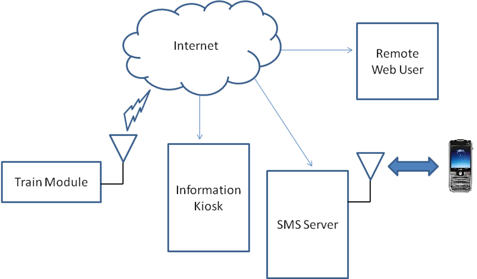
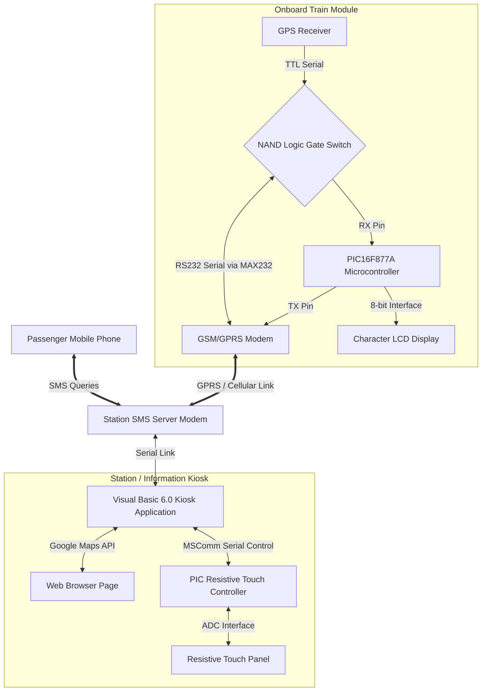
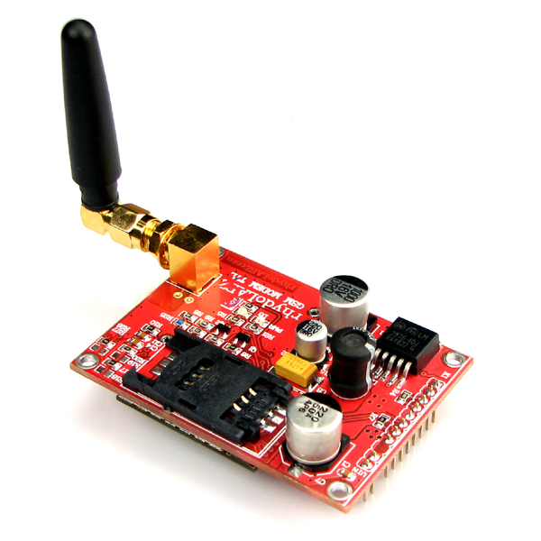
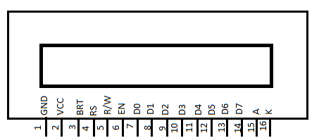
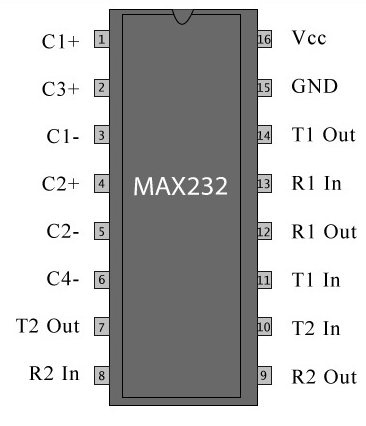
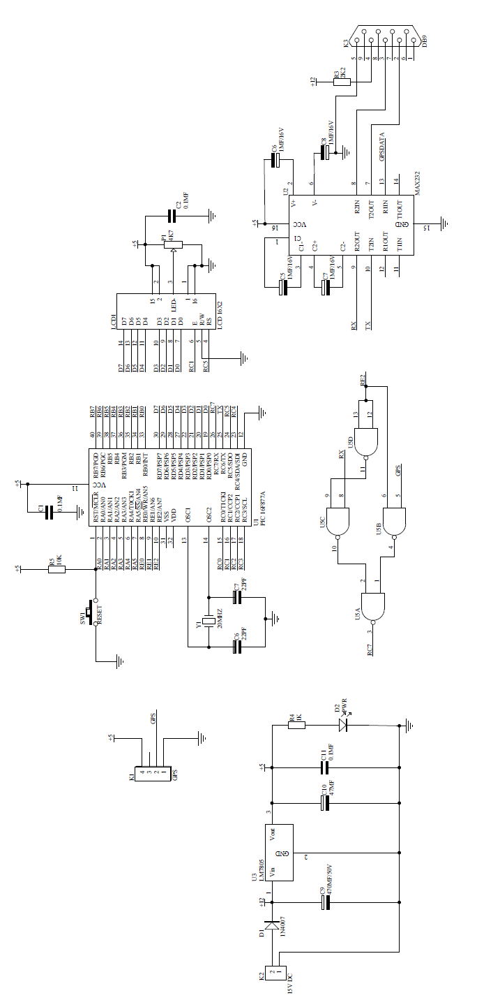
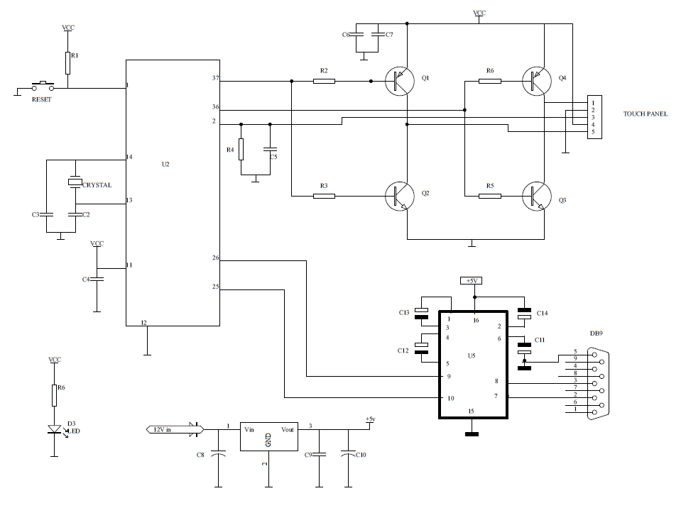

# Train Tracking and Information System with Touch-Screen & SMS Interface

An automated telemetry tracking system that gathers real-time train locations using onboard GPS, transmits coordinates over GPRS, presents the live position on an interactive touch-screen kiosk, and responds to passenger queries via automated SMS messages.

---

## 📋 Table of Contents
1. [Project Overview & Abstract](#-project-overview--abstract)
   * [Problem Statement](#-problem-statement)
   * [Proposed Solution](#-proposed-solution)
2. [Key Features](#-key-features)
3. [Project Documentation & Reports](#-project-documentation--reports)
4. [System Architecture & Components](#-system-architecture--components)
5. [Hardware & Power Components](#-hardware--power-components)
6. [PCB Fabrication](#-pcb-fabrication)
7. [Software & Development Tools](#-software--development-tools)
8. [Firmware & Source Code](#-firmware--source-code)
9. [Circuit Schematics](#-circuit-schematics)
10. [Getting Started & Build Instructions](#-getting-started--build-instructions)
11. [Results & Limitations](#-results--limitations)
12. [Future Scope](#-future-scope)
13. [Project Team & Credits](#-project-team--credits)
14. [License](#-license)

---

## 🌐 Project Overview & Abstract

This project was developed as our **B.Tech Main Project** during the academic year **2011–2012** for the Bachelor of Technology in Electronics & Communication Engineering at the **Federal Institute of Science and Technology (FISAT)**, Ernakulam (affiliated with Mahatma Gandhi University).

### 🔍 Problem Statement
Finding the real-time location of a train can be difficult for passengers, especially during bad weather or night journeys. People inside closed coaches are often unaware of upcoming stations or the Expected Time of Arrival (ETA), and passengers waiting at intermediate stations lack a reliable way to know if a train is running on time or where it is currently located.

### 💡 Proposed Solution
This project eliminates these difficulties by making train status information easily accessible. An onboard module coordinates tracking operations, continuously updating coordinates via a GPS receiver and periodically uploading them to a remote station server via GPRS communication. This enables passengers and station operators to track the train in real-time from anywhere in the world using Google Maps.

In addition, a Kiosk application calculates the distance between the current coordinates of the train and a database of upcoming stations. Passengers can request train tracking status simply by sending an SMS to the station module, which decodes the request and sends a detailed SMS reply containing the current position, distance to the next station, and expected travel time so passengers do not miss their stations.

---

## ✨ Key Features

*   **Real-time Location Telemetry**: The onboard train module continuously reads and parses GPS NMEA sentences to extract latitude, longitude, and speed.
*   **Interactive Touch Kiosk**: Designed a station information kiosk using a resistive touch-screen controller. Passengers can touch menu items to query trains and view locations plotted on Google Maps.
*   **Automated SMS Responder**: Passengers can send an SMS query containing the train number to the server. The server computes the distance to the next station and replies with the current station name, distance, and Expected Time of Arrival (ETA) based on train speed.
*   **Local LCD Debugging**: Displays local IP address, connection flags, and telemetry transfer status directly on an onboard character LCD.

---

## 📂 Project Documentation & Reports

The complete academic documentation, certificates, and schematics for this project are archived and organized as follows:

*   **[Full Project Report](docs/report_body.md)**: Contains the complete 9-chapter engineering report, covering introduction, block diagrams, circuit descriptions, component specifications, PCB fabrication steps, and software architecture.
*   **[Front Pages & Certificates](docs/front_pages.md)**: Contains the official project title sheet, certificates of approval, student declaration, and executive abstract.
*   **[Circuit Diagrams & PCB Schematics](diagram/)**: High-fidelity PDF schematics for the onboard train module circuit ([Protel Schem.pdf](diagram/Protel%20Schem.pdf)) and the touch screen controller board ([touch.pdf](diagram/touch.pdf)).

---

## 🏗️ System Architecture & Components

The tracking system consists of three primary divisions:

### 1. Train Module
The onboard Train Module is responsible for location telemetry collection. The PIC microcontroller parses the latitude, longitude, and speed from the NMEA strings, controls the switching circuit to toggle between GPRS and GPS interfaces, and sends the coordinate packet over the GPRS cellular link.

### 2. Interactive Touch Kiosk
At stations, a resistive touch-screen panel is overlaid on a monitor to provide an interactive information kiosk. It uses a PIC coordinate reader to translate analog voltage drops into serial mouse movement commands, interfacing with a VB6 application that plots trains on Google Maps.

### 3. SMS Server
An automated desktop application connected to a GSM modem listens for inbound query messages. It decodes the query, calculates the distance to the next station and the Estimated Time of Arrival (ETA), and responds to the passenger's mobile phone.

---

## 🛠️ Hardware & Power Components

### Main Microcontrollers & Modules

| GPS Module (AN-Top) | GSM/GPRS Modem | PIC16F877A Controller |
| :---: | :---: | :---: |
|  |  |  |

### LCD & Level Conversion Components

| 16x2 LCD Display | MAX232 Level Converter | Power Supply Regulator |
| :---: | :---: | :---: |
|  |  |  |

*   **Microcontroller**: PIC16F877A (8-bit RISC, 8KB Flash, 368B RAM, 10-bit ADC).
*   **GPS Receiver**: Standalone 5V serial Patch Antenna On Top (POT) module.
*   **GSM/GPRS Modem**: RhydoLABZ Tri-Band Engine (EGSM 900MHz, DCS 1800MHz, PCS 1900MHz) with internal TCP/IP stack.
*   **Level Converter**: MAX232 for RS232-to-TTL level translation.
*   **Touch Panel**: 4-wire resistive touch screen with H-bridge driver.
*   **Display**: 16x2 characters intelligent LCD display with backlighting.
*   **Power Supply**: A 15V DC supply regulated down to a constant 5V using an LM7805 voltage regulator with built-in thermal and short-circuit protection.

---

## 🖨️ PCB Fabrication

The project involved custom hardware manufacturing:
*   **Layout Design**: Component layout was drafted on graph paper to minimize board footprint, followed by track routing mapped to handle varied current loads.
*   **Etching**: The layouts were printed onto positive copper black UV translucent artwork film, transferred to pre-coated photo-resist fiberglass (FR4) boards via UV exposure, and etched using a ferric chloride solution.
*   **Drilling & Soldering**: Custom drilling was done per component specifications (e.g., 1mm for ICs, 1.5mm for diodes) before final wave soldering and testing.

---

## 🖥️ Software & Development Tools

The development stack spanned multiple environments:
*   **Embedded C**: The core logic language for all onboard and touch-panel microcontrollers.
*   **Keil µVision IDE**: Used for project management, compiling, and debugging the embedded C code for the PIC microcontrollers.
*   **Visual Basic 6.0**: Utilized to build the interactive desktop GUI for the kiosk application, handling MSComm serial control libraries and rendering the Google Maps API.
*   **Protel**: Used for drawing the electronic circuit schematics and designing the PCB traces.

---

## 💻 Firmware & Source Code

The source code has been extracted and organized into logical modules.

> [!NOTE]
> The microchip C firmware source files and the Visual Basic 6.0 kiosk/SMS server application are both included in this repository.

### 1. Onboard Train Module Firmware
Located under [`code/train_module/`](code/train_module/):
*   [`main.c`](code/train_module/main.c): Core firmware loop. Coordinates GPS parsing interrupts, handles GPRS modem TCP commands (`AT+CIPSERVER`, `AT+CIPSEND`), and manages the multiplexer switching pin (`RE2`).
*   [`modem.h`](code/train_module/modem.h) & [`modem.c`](code/train_module/modem.c): Hardware configurations, LCD pin mapping, string and command functions, and UART drivers.
*   [`delay.h`](code/train_module/delay.h) & [`delay.c`](code/train_module/delay.c): Microsecond and millisecond delay loops tailored for a 20MHz crystal oscillator.

### 2. Touch Screen Kiosk Firmware
Located under [`code/touch_module/`](code/touch_module/):
*   [`main.c`](code/touch_module/main.c): Scans X and Y axes on the resistive touch panel by manipulating transistors on the H-bridge (`RB3`, `RB4`, and `RA0` ADC input) and transmits Microsoft serial mouse protocol coordinate packets.

### 3. VB6 Kiosk & SMS Server Application
Located under [`code/kiosk_program/`](code/kiosk_program/):

> [!NOTE]
> The VB6 source code for the desktop kiosk and SMS server is preserved here for archival and reference purposes.

*   [`TrainTracking.vbp`](code/kiosk_program/TrainTracking.vbp): VB6 project file. Compiles to `Train.exe`.
*   [`Form1.frm`](code/kiosk_program/Form1.frm): Main kiosk form — handles Winsock TCP connection to the onboard train module (port 2050), MSComm serial control for the GSM modem, on-screen touch keypad, GPS coordinate parsing (NMEA → decimal degrees), and automated SMS reply logic.
*   [`Form2.frm`](code/kiosk_program/Form2.frm): Station data entry form — allows adding station records (lat/lon, location, next station, distance) to the Access database.
*   [`frmBrowser.frm`](code/kiosk_program/frmBrowser.frm): Embedded IE WebBrowser control that renders train position on a map using lat/lon coordinates.
*   [`connection.bas`](code/kiosk_program/connection.bas): ADO database connection module — opens `railway.mdb` via Microsoft Jet OLEDB 4.0 provider.
*   [`Module2.bas`](code/kiosk_program/Module2.bas): Utility module — numeric input validation and Enter-to-Tab key handling. Declares `kernel32.Sleep` API.
*   [`railway.mdb`](code/kiosk_program/database/railway.mdb): MS Access database containing the `details` table with station coordinates, names, and distances.

#### Legacy Dependencies
The VB6 application requires several ActiveX controls that were standard in the Windows XP / VB6 era:
*   **MSADODC.OCX** — ADO Data Control (database binding)
*   **MSCOMM32.OCX** — Serial port communication (GSM modem interface)
*   **MSWINSCK.OCX** — Winsock TCP/IP control (train module connection)
*   **MSINET.OCX** — Internet Transfer Control
*   **shdocvw.dll** — Internet Explorer WebBrowser Control

All required OCX files and runtime DLLs are included in the [`code/kiosk_program/installer/`](code/kiosk_program/installer/) directory, along with a prebuilt **setup program** (`setup.exe`) that registers the dependencies and installs a compiled `Train.exe` on Windows.

---

## 🔌 Circuit Schematics

The original schematic and PCB designs are stored in PDF format under the [`diagram/`](diagram/) folder:

### 1. Onboard Train Module
Contains the PIC16F877A, character LCD, MAX232 level converter, and the NAND gate multiplexer switching logic.
*   [Protel Schem.pdf](diagram/Protel%20Schem.pdf) (Complete PCB Schematic)

### 2. Touch Screen Controller
Features the H-bridge switching transistors and analog-to-digital coordinate reader.
*   [touch.pdf](diagram/touch.pdf) (Complete PCB Schematic)

---

## 🚀 Getting Started & Build Instructions

### 1. Compiling Microcontroller Firmware
The microcontrollers are programmed in Embedded C using the HI-TECH C compiler (or Keil µVision IDE):
1.  Open Keil µVision and create a new project.
2.  Select **PIC16F877A** as the target device.
3.  Add the C source files from `code/train_module/` or `code/touch_module/`.
4.  Configure the oscillator frequency to **20 MHz** (HS oscillator mode).
5.  Build the project to generate the target `.hex` flash binary.
6.  Flash the binary using a PIC programmer (e.g., PICkit 2 or PICkit 3).

### 2. Desktop Kiosk Application
> [!NOTE]
> The VB6 source code is available under [`code/kiosk_program/`](code/kiosk_program/). It requires Visual Basic 6.0 IDE (SP6) to open and compile.

1.  Open `TrainTracking.vbp` in the VB6 IDE.
2.  Ensure the required OCX controls are registered (available in `code/kiosk_program/installer/Support/`).
3.  Set the COM port in the `Combo2` dropdown to match your USB-Serial adapter.
4.  Place `railway.mdb` in the same directory as the compiled executable.
5.  Compile via **File → Make Train.exe**.

Alternatively, a prebuilt VB6 Package & Deployment installer is available under [`code/kiosk_program/installer/`](code/kiosk_program/installer/). Running `setup.exe` will register all required OCX controls and install the compiled application.

---

## 📊 Results & Limitations

*   **Results**: The hardware successfully achieved real-time train tracking, efficiently querying coordinates via SMS and rendering live locations interactively on the kiosk's Google Maps interface.
*   **Limitations**: System accuracy depends heavily on the placement of the GPS receiver, which requires a clear line of sight to satellites. Additionally, continuous telemetry relies on stable cellular network coverage; connection dropouts in remote areas temporarily delay data transmission.

---

## 🔮 Future Scope

While originally designed for the railway network, the telemetry and tracking architecture is highly adaptable. It can be implemented in:
*   **Public Transit**: Live tracking for municipal buses or school/college transport.
*   **Logistics & Freight**: Remote tracking for shipping containers and long-haul carriers requiring cross-country monitoring.
*   **Modernization**: Upgrading from VB6 to modern web frameworks (e.g., Node.js/React) and transitioning from 2G/GPRS to 4G/LTE or LPWAN modules.

---

## 👥 Project Team & Credits

This project was designed, built, and documented by:
*   **Johney Cherian**
*   **Jyothis George Thaliath**
*   **Merin Jose**
*   **Mithin Mathew**

Thanks to the Department of Electronics & Communication Engineering, FISAT, and our project coordinators for their support.

---

## 📄 License

This repository is licensed under the **MIT License** — see the [LICENSE](LICENSE) file for details.

---

> [!NOTE]
> This repository is published as a portfolio and archival record of a **Bachelor of Technology (B.Tech) Main Project** completed during the academic year **2011–2012**. The hardware choices, development environment, and coding style reflect the systems and tools available at that time.
