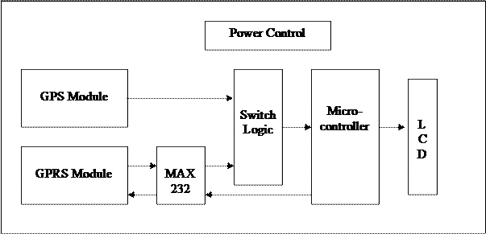
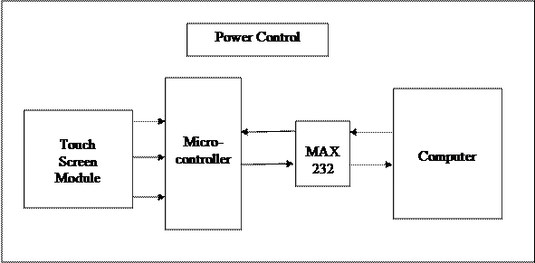
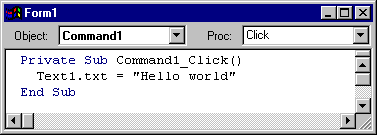
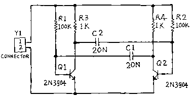
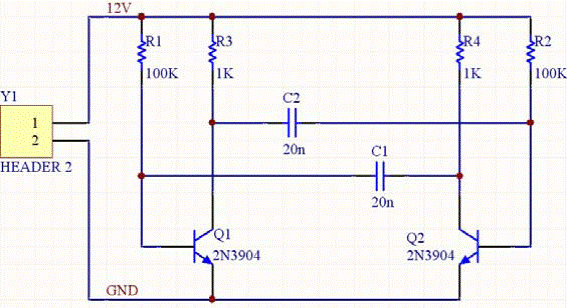

# Train Tracking System — Full Project Report

## Chapter 1: INTRODUCTION

Finding the real-time location of a train is a major difficulty faced by railway passengers, especially when traveling at night or during adverse weather conditions. Passengers at intermediate stations often have no reliable way to know if a train is running on time, nor its current location, other than generic audio announcements at the station which are frequently delayed or inaccurate.

This project resolves these issues by utilizing **Global Positioning System (GPS)** and **General Packet Radio Service (GPRS)** technologies to establish a continuous tracking and information system. The system tracks the real-time coordinates of the train, uploads them to a central database server, and serves this data to users through two main channels:
1. **Interactive Station Kiosks (Web Interface)**: Allows passengers to view the current position of the train plotted on a Google Maps interface using touch-screen panels.
2. **SMS Queries**: Allows passengers with any mobile phone to query the status of a train by sending a text message, receiving an automated SMS reply containing the train's current station, distance to the next station, and Expected Time of Arrival (ETA).

The project is divided into two primary subsystems:
- **Onboard Train Module**: Contains a PIC16F877A microcontroller, a GPS receiver, a GPRS modem, a status LCD, and a logic gate-based multiplexing switching circuit. It collects satellite tracking data and transmits it to the server.
- **Station Module & Kiosk**: A Visual Basic application communicating with a GSM/GPRS modem that monitors passenger SMS requests, computes station distances mathematically, and renders live mapping interfaces.

---

## Chapter 2: BLOCK DIAGRAMS

The overall tracking system is divided into four main functional blocks: the **Train Module**, the **Information Kiosk**, the **SMS Server**, and the **Web Interface**.

*Fig. 2.1: System Overview Block Diagram*

### 2.1 Train Module
The onboard Train Module is responsible for location telemetry collection. It consists of a PIC16F877A microcontroller, a GPS module, and a GPRS modem. The GPS module continuously decodes raw coordinate strings from satellite signals. The PIC microcontroller parses the latitude, longitude, and speed from the NMEA strings, controls the switching circuit to toggle between GPRS and GPS interfaces, and sends the coordinate packet over the GPRS cellular link to the station receiver.

*Fig. 2.2: Onboard Train Module Block Diagram*

### 2.2 Information Kiosk
The station Information Kiosk consists of a PC interface controlled by a resistive touch-screen panel. The kiosk user interface is a Visual Basic application displaying a menu of active trains. When a user touches the screen to select a train, the kiosk application sends a query over the internet to the onboard train module. The train module responds with its current GPS coordinates, and the kiosk application loads a WebBrowser control displaying the exact position on Google Maps.

*Fig. 2.3: Information Kiosk Block Diagram*

### 2.3 SMS Server
The SMS Server runs on a desktop computer connected to a GSM modem. When a passenger sends an SMS query to the server, the application decodes the message, retrieves the last known coordinates of the queried train from the database, and queries its station database. It calculates the distance to the next station and the estimated time of arrival (ETA), and formats a response text message which is sent back to the passenger's mobile phone.

### 2.4 Web Interface
The same mapping interface running on the Kiosk PC can be distributed as a web application. This allows users at home or on the move to monitor train locations from any internet-enabled computer or device.

---

## Chapter 3: CIRCUIT DIAGRAMS

### 3.1 Touch-Screen Module

*Fig. 3.1: Circuit of Touch-Screen Module*

The touch-screen interface circuit features a PIC16F877A microcontroller, an H-bridge driver circuit, a resistive touch panel, and a MAX232 level converter. The PIC microcontroller is clocked by a crystal oscillator connected to OSC1 (Pin 13) and OSC2 (Pin 14). A 15V DC power supply is stepped down and regulated to a stable +5V using an LM7805 voltage regulator.

The H-bridge circuit consists of four transistors: two NPN transistors (Q2 and Q3) and two PNP transistors (Q1 and Q4). The microcontroller controls the H-bridge using pins `RB3` (Pin 36), `RB4` (Pin 37), and `RA0` (Pin 2). By switching the transistors, the PIC alternates the voltage polarities across the resistive touch panel's X and Y planes. The analog touch coordinates are read via the ADC input of the PIC, which are then encoded and transmitted over the UART `TX` (Pin 25) and `RX` (Pin 26) pins through the MAX232 level converter to the PC serial port (DB9 connector).

### 3.2 Train Module

*Fig. 3.2: Circuit of Train Module*

The onboard train circuit consists of a PIC16F877A microcontroller, a 16x2 character LCD, a GPS module, a GPRS modem, a MAX232 level converter, and a NAND-gate switching circuit. The LCD data pins (D0–D7) are connected to PORTD of the PIC, while control pins Enable (EN) and Register Select (RS) are connected to `RC1` (Pin 16) and `RC5` (Pin 24) respectively. The Read/Write (R/W) pin is grounded. Power is supplied by a regulated 12V/5V LM7805 circuit.

Because the GPS module uses TTL logic and the GPRS modem uses RS232 CMOS levels, the PIC must interface with both devices using different signal levels. To share the single hardware serial RX pin on the PIC, a switching circuit is constructed using four NAND gates (U5A, U5B, U5C, and U5D).
- NAND U5D acts as an inverter for the multiplexer selection signal from pin `RE2` (Pin 10) of the PIC.
- When `RE2` is High, NAND gate U5B is enabled, routing the GPS TTL serial data directly to the PIC's UART RX pin `RC7` (Pin 26).
- When `RE2` is Low, NAND gate U5C is enabled, routing the GPRS modem's serial RX data (translated via MAX232) to the PIC's UART RX pin.
- The PIC's UART TX pin is connected directly to the GPRS modem's input.

---

## Chapter 4: COMPONENT DESCRIPTION

### 4.1 LCD Display
The Train Module uses a standard 16x2 character LCD display (16 characters per line, 2 lines) with an LED backlight. It displays the initialization status, GPRS network messages, IP address, and coordinates. The display operates via an internal command register (selected when `RS = 0`) and a character data register (selected when `RS = 1`). Data write operations require the Enable (`EN`) pin to be pulsed high.

*Fig. 4.1: Character LCD Module*

### 4.2 Power Supply
The circuits use a regulated power supply based on the LM7805 voltage regulator IC. It takes a 12V–15V DC input and outputs a steady +5V DC. The 78xx series regulators feature built-in thermal overload and short-circuit protection.

*Fig. 4.2: Regulated LM7805 Power Supply Circuit*

### 4.3 GSM/GPRS Modem
The GPRS/GSM modem is a tri-band module operating on EGSM 900 MHz, DCS 1800 MHz, and PCS 1900 MHz frequencies. It features a built-in TCP/IP stack to support internet connections over GPRS. The modem communicates with the microcontroller using standard AT commands over an RS232 serial interface.

*Fig. 4.3: GSM/GPRS Modem*

### 4.4 GPS Module
The GPS module is a high-gain standalone receiver with a Patch Antenna On Top (POT). It outputs standard NMEA0183 sentences (such as `$GPRMC` and `$GPGGA`) in raw serial ASCII format. It contains an internal RTC backup battery and can be connected directly to the microcontroller's UART RX pin.

*Fig. 4.4: GPS Receiver Module*

### 4.5 MAX232 Serial Level Converter
The MAX232 IC converts serial signals between RS232 levels (-15V to +15V) and TTL logic levels (0V to +5V). It uses a charge pump with external capacitors to generate the required RS232 voltages from a single +5V supply.

*Fig. 4.5: MAX232 Level Converter Pinout*

### 4.6 PIC16F877A Microcontroller
The PIC16F877A is a 40-pin RISC-based 8-bit microcontroller. It features 8KB of Flash program memory, 368 bytes of RAM, 256 bytes of EEPROM, multiple timers, a 10-bit Analog-to-Digital Converter (ADC), and a hardware USART port.

*Fig. 4.6: PIC16F877A Microcontroller Pinout*

### 4.7 Touch Screen Panel
The resistive touch panel replaces a standard mouse. It consists of two transparent resistive layers separated by spacers. When pressed, the layers touch, causing a voltage drop along the X and Y axes. The PIC16F877A ADC inputs read these voltages, which are then converted into serial mouse movements.

---

## Chapter 5: PCB FABRICATION

Printed Circuit Boards (PCBs) are fabricated to ensure stable, noise-free operation of the high-frequency crystal and cellular telemetry signals. Protel CAD software is used to design the layouts.

### 5.1 Design Steps
1. **Component Layout**: Placement of ICs, resistors, and capacitors on a graph sheet to minimize board area.
2. **PCB Layout**: Drawing the trace connections. Power traces are sized between 1.5mm and 3.0mm depending on the current flow, while signal lines are kept around 0.8mm.
3. **Artwork Printing**: Printing the layout onto transparent film or butter paper.
4. **Etching**: The layout is transferred to the copper-clad laminate using photoresist exposure under UV light or ink screen printing. The board is etched in a ferric chloride ($FeCl_3$) solution (40g–50g of chemical per liter of water) to remove excess copper.
5. **Drilling & Soldering**: Drill sizes are 1.0mm for IC pins, 1.25mm for resistors/capacitors, and 1.5mm for diodes. Components are soldered using lead-tin alloy solder.

---

## Chapter 7: SOFTWARE SECTION

The software architecture consists of two main parts: the PIC16F877A C firmware and the Visual Basic 6 kiosk application.

*Fig. 7.1: Visual Basic 6 IDE Interface*

### 7.1 Software Platforms Used

#### 7.1.1 Visual Basic 6.0
Visual Basic 6.0 (VB6) is used to develop the desktop kiosk application and the SMS server. It communicates with the GSM modem and Touch Screen controller using the **MSComm** serial control. The UI features forms, buttons, and a WebBrowser control that renders the Google Maps tracking page.

#### 7.1.2 Keil µVision
The Keil µVision IDE is used to write, compile, and debug the PIC16F877A C firmware. It provides simulator testbenches and code compilation into `.hex` binaries for programming the microcontrollers.

#### 7.1.3 Protel Schematic
Protel CAD is used to generate circuit schematics and route the PCB tracks.

*Fig. 7.2: Example Circuit Drawing in Protel*

*Fig. 7.3: Complete Routed Schematic Using Protel*

#### 7.1.4 Embedded C
The firmware is written in Embedded C using the HI-TECH C compiler syntax. The code is structured to handle hardware interrupts (for UART reception) and drive the peripherals (LCD, ADC, and GPRS modems).

---

## Chapter 8: RESULTS

The Train Tracking System successfully performs real-time geo-location tracking. The GPS receiver decodes satellite telemetry, which is successfully transmitted by the onboard GPRS modem to the station Kiosk. The Kiosk correctly renders the location using Google Maps, and the SMS server responds to passenger queries with distance details.

### Key Challenges
- **GPS Coverage**: The onboard Patch antenna requires a clear line-of-sight to the sky. Satellite signal acquisition is degraded inside thick metal structures or tunnels.
- **Cellular Network Signal**: GPRS connection stability is dependent on network provider signal coverage along the railway route.

---

## Chapter 9: CONCLUSION AND FUTURE SCOPE

The Train Tracking System demonstrates a reliable and cost-effective method for tracking vehicles. By combining GPS and cellular networks, it offers long-range telemetry tracking.

### Future Scope
- **Wider Transport Application**: The tracking module can be integrated into school/college buses, public transit, and delivery trucks.
- **Logistics & Freight Management**: Can be applied to track containers, cargo trains, and shipping fleets across long distances.
- **Automated Announcements**: The coordinates can be linked to audio synthesized speakers in passenger coaches to automatically announce upcoming stations.
